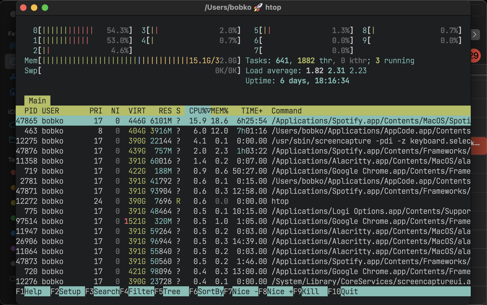
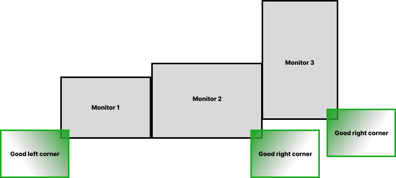
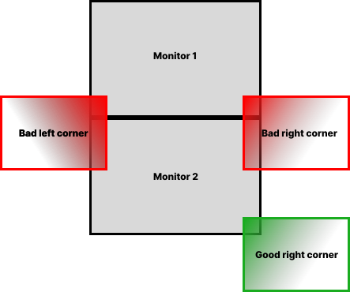
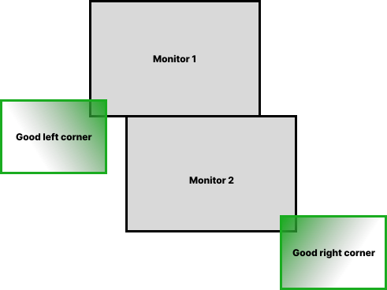

# Guide

This Guide is designed to be read from top to bottom as a whole. You can skip parts that are obvious.

## Installation

AeroSpace-edge is distributed as a zip on the
[releases page](https://github.com/vitorebatista/AeroSpace-edge/releases/latest). There is
no Homebrew cask for the fork — `brew install --cask nikitabobko/tap/aerospace` installs
*upstream* AeroSpace, which is a different app.

1.  Download the latest zip from the
    [releases page](https://github.com/vitorebatista/AeroSpace-edge/releases/latest)

2.  Unpack the zip

3.  Put the unpacked `AeroSpace-edge-v$VERSION/AeroSpace-edge.app` in `/Applications`

4.  Put the unpacked `AeroSpace-edge-v$VERSION/bin/aerospace-edge` anywhere on your `$PATH`
    (optional; only needed to interact with AeroSpace-edge from the CLI)

```bash
unzip AeroSpace-edge-v*.zip
mv AeroSpace-edge-v*/AeroSpace-edge.app /Applications/
cp  AeroSpace-edge-v*/bin/aerospace-edge /usr/local/bin/
open -a /Applications/AeroSpace-edge.app
```

Shell completions for bash, fish and zsh ship in the zip under `shell-completion/`.

### Installs alongside upstream AeroSpace

The fork has its own bundle id (`vitorebatista.aerospace-edge`), app name, socket and
Accessibility grant, so it never overwrites an existing `/Applications/AeroSpace.app`. You
can keep both installed and run one at a time.

### Gatekeeper

If you see this message

    "AeroSpace-edge.app" can't be opened because Apple cannot check it for malicious software.

**Option 1** to resolve the problem

    xattr -d com.apple.quarantine /Applications/AeroSpace-edge.app

**Option 2** to resolve the problem

1.  navigate in Finder to `/Applications/AeroSpace-edge.app`

2.  Right mouse click

3.  Open (yes, it’s that stupid)

## Configuring AeroSpace

### Custom config location

AeroSpace-edge looks for its own config first, then falls back to an upstream AeroSpace
config. In priority order:

1.  `~/.aerospace-edge.toml`

2.  `${XDG_CONFIG_HOME}/aerospace-edge/aerospace-edge.toml`

3.  `~/.aerospace.toml`

4.  `${XDG_CONFIG_HOME}/aerospace/aerospace.toml`

(`XDG_CONFIG_HOME` falls back to `~/.config` if the variable is not set.)

The two tiers are resolved independently, so having both an `aerospace-edge` config and an
upstream `aerospace` config is not ambiguous — the fork's own config simply wins. That lets
you run the fork next to upstream on the very same config, while `~/.aerospace-edge.toml`
stays available for fork-only options upstream would reject.

If the config is found in more than one location *within the same tier*, the ambiguity is
reported.

### Settings window

Open the direct **Settings…** item in the AeroSpace-edge menu-bar menu to edit the active
config file. It is a source-preserving editor for that TOML file, not a separate settings
store; Application controls such as reload, menu-bar appearance, and update checking live
there too.

See the dedicated [Settings guide](settings.md) for every pane and option, screenshots,
file-resolution and first-save behavior, raw recovery, validation and preservation rules,
external-change handling, symlinks, and the transactional version-1-to-version-2 migration
with byte-identical backup and restore instructions.

### Config samples

Please see the following config samples:

- [The default config](#default-config)

- [i3 like config](goodies.md#i3-like-config)

- [Search for configs by other users on GitHub](https://github.com/search?q=path%3A*aerospace.toml&type=code) for inspiration

AeroSpace uses TOML format for the config. TOML is easy to read, and it supports comments. See [TOML spec for more info](https://toml.io/en/v1.0.0)

### Default config

The default config is part of the documentation, it contains all trivial configuration keys with comments. Please read the default config! Non-trivial configuration options are mentioned further in this guide. If no custom config is found, AeroSpace will load the default config.

If the key is omitted in the custom config, it falls back to the value in the default config, unless it’s stated otherwise for the specific keys. Namely:

- `mode.*.binding`. It falls back to the empty TOML table. Your config is the source of truth for keyboard bindings. You must explicitly mention all the keyboard bindings and [binding modes](#binding-modes) in your config.

- `on-focused-monitor-changed`. It falls back to the empty TOML array.

- `exec` TOML table. See: [exec-* Environment Variables](#exec-env-vars) (It’s so boring and verbose, I don’t even want to mention it in the `default-config.toml`)

Rule of thumb: all the "scalar like" values always fall back to the default config. All the "vector like" values fall back to the empty TOML array or table.

That allows you to keep your config tidy and clean from trivial config keys for which you like the default values. You can bootstrap your custom config by copying the default config from the app installation -

``` shell
cp /Applications/AeroSpace-edge.app/Contents/Resources/default-config.toml ~/.aerospace-edge.toml
```

[Download default-config.toml](config-examples/default-config.toml)

``` toml
## Place a copy of this config to ~/.aerospace-edge.toml

## After that, you can edit ~/.aerospace-edge.toml to your liking

## Config version for compatibility and deprecations

## Fallback value (if you omit the key): config-version = 1

config-version = 2

## You can use it to add commands that run after AeroSpace startup.

## Available commands : https://vitorebatista.github.io/AeroSpace-edge/#commands

after-startup-command = []

## Start AeroSpace at login

start-at-login = false

## Automatically reload the config when the config file is saved

## After setting this to true, reload once manually to start the auto-reloading

auto-reload-config = false

## Normalizations. See: https://vitorebatista.github.io/AeroSpace-edge/guide/#normalization

enable-normalization-flatten-containers = true
enable-normalization-opposite-orientation-for-nested-containers = true
## When true, forces the tree to be binary and orients each container by the aspect ratio of its rect

## (horizontal if wider than tall, vertical otherwise). Overrides the opposite-orientation normalization.

enable-normalization-binary-tree = false

## See: https://vitorebatista.github.io/AeroSpace-edge/guide/#layouts

## The 'accordion-padding' specifies the size of accordion padding

## You can set 0 to disable the padding feature

accordion-padding = 30

## Possible values: tiles|accordion

default-root-container-layout = 'tiles'

## Possible values: horizontal|vertical|auto

## 'auto' means: wide monitor (anything wider than high) gets horizontal orientation,

##               tall monitor (anything higher than wide) gets vertical orientation

default-root-container-orientation = 'auto'

## Mouse follows focus when focused monitor changes

## Drop it from your config, if you don't like this behavior

## See https://vitorebatista.github.io/AeroSpace-edge/guide/#on-focus-changed-callbacks

## See https://vitorebatista.github.io/AeroSpace-edge/commands/move-mouse/

## Fallback value (if you omit the key): on-focused-monitor-changed = []

on-focused-monitor-changed = ['move-mouse monitor-lazy-center']

## You can effectively turn off macOS "Hide application" (cmd-h) feature by toggling this flag

## Useful if you don't use this macOS feature, but accidentally hit cmd-h or cmd-alt-h key

## Also see: https://vitorebatista.github.io/AeroSpace-edge/goodies/#disable-hide-app

automatically-unhide-macos-hidden-apps = false

## What to do when an app activates itself while its window lives on another workspace.

## Possible values: always|smart

##   'always' - follow the activation and switch to that workspace (upstream behavior)

##   'smart'  - switch only when the activation looks user-initiated (preceded by a mouse

##              click: Dock icon, notification banner, window on another monitor).

##              Input-less self-activations ("focus stealing") no longer switch your

##              workspace. Note: cmd-tab is keyboard-driven, so under 'smart' it won't

##              auto-switch either - use the workspace keybinding instead.

## Fallback value (if you omit the key): focus-follows-app-activation = 'always'

focus-follows-app-activation = 'always'

## When a new window opens, move it offscreen the instant it's detected so macOS never

## paints it at its native spawn position (usually screen center) before AeroSpace tiles it.

## Reduces the flash/jump you see when a window appears and the tiles rearrange.

## Opt-in because moving windows via the Accessibility API is app-dependent.

## Fallback value (if you omit the key): new-window-prevent-flicker = false

new-window-prevent-flicker = false
## Draw a colored border around the currently focused window.

## Native alternative to external tools like JankyBorders for the focused-window case.

## Fallback value (if you omit the key): focused-window-border = false

focused-window-border = false
## Border color as 0xAARRGGBB (alpha, red, green, blue). Same format as JankyBorders.

## Fallback value (if you omit the key): focused-window-border-color = '0xff12B981'

focused-window-border-color = '0xff12B981'
## Border thickness in points.

## Fallback value (if you omit the key): focused-window-border-width = 4

focused-window-border-width = 4
## Border opacity as a percentage 0-100. Multiplies the alpha of the color above.

## Fallback value (if you omit the key): focused-window-border-opacity = 100

focused-window-border-opacity = 100
## Corner radius (points) of the window the border hugs. macOS does not expose the

## per-window corner radius, so this is a global value - tune it to match your apps.

## Fallback value (if you omit the key): focused-window-border-radius = 10

focused-window-border-radius = 10
## Pull the border this many points back into the window so the window's own rounded

## corner masks any radius mismatch (hides corner gaps). 0 = border fully outside.

## Fallback value (if you omit the key): focused-window-border-inset = 0

focused-window-border-inset = 0

## List of workspaces that should stay alive even when they contain no windows,

## even when they are invisible.

## This config option is only available since 'config-version = 2'

## Fallback value (if you omit the key): persistent-workspaces = []

persistent-workspaces = ["1", "2", "3", "4", "5", "6", "7", "8", "9", "A", "B",
                         "C", "D", "E", "F", "G", "I", "M", "N", "O", "P", "Q",
                         "R", "S", "T", "U", "V", "W", "X", "Y", "Z"]

## A callback that runs every time binding mode changes

## See: https://vitorebatista.github.io/AeroSpace-edge/guide/#binding-modes

## See: https://vitorebatista.github.io/AeroSpace-edge/commands/mode/

on-mode-changed = []

## Possible values: (qwerty|dvorak|colemak)

## See https://vitorebatista.github.io/AeroSpace-edge/guide/#key-mapping

[key-mapping]
    preset = 'qwerty'

## Gaps between windows (inner-*) and between monitor edges (outer-*).

## Possible values:

## - Constant:     gaps.outer.top = 8

## - Per monitor:  gaps.outer.top = [{ monitor.main = 16 }, { monitor."some-pattern" = 32 }, 24]

##                 In this example, 24 is a default value when there is no match.

##                 Monitor pattern is the same as for 'workspace-to-monitor-force-assignment'.

##                 See:

##                 https://vitorebatista.github.io/AeroSpace-edge/guide/#assign-workspaces-to-monitors

[gaps]
    inner.horizontal = 0
    inner.vertical =   0
    outer.left =       0
    outer.bottom =     0
    outer.top =        0
    outer.right =      0

## 'main' binding mode declaration

## See: https://vitorebatista.github.io/AeroSpace-edge/guide/#binding-modes

## 'main' binding mode must be always presented

## Fallback value (if you omit the key): mode.main.binding = {}

[mode.main.binding]

    # All possible keys:
    # - Letters.        a, b, c, ..., z
    # - Numbers.        0, 1, 2, ..., 9
    # - Keypad numbers. keypad0, keypad1, keypad2, ..., keypad9
    # - F-keys.         f1, f2, ..., f20
    # - Special keys.   minus, equal, period, comma, slash, backslash, quote, semicolon,
    #                   backtick, leftSquareBracket, rightSquareBracket, space, enter, esc,
    #                   backspace, tab, pageUp, pageDown, home, end, forwardDelete,
    #                   sectionSign (ISO keyboards only, european keyboards only)
    # - Keypad special. keypadClear, keypadDecimalMark, keypadDivide, keypadEnter, keypadEqual,
    #                   keypadMinus, keypadMultiply, keypadPlus
    # - Arrows.         left, down, up, right

    # All possible modifiers: cmd, alt, ctrl, shift

    # All possible commands: https://vitorebatista.github.io/AeroSpace-edge/#commands

    # See: https://vitorebatista.github.io/AeroSpace-edge/commands/exec-and-forget/
    # You can uncomment the following lines to open up terminal with alt + enter shortcut
    # (like in i3)
    # alt-enter = '''exec-and-forget osascript -e '
    # tell application "Terminal"
    #     do script
    #     activate
    # end tell'
    # '''

    # See: https://vitorebatista.github.io/AeroSpace-edge/commands/layout/
    alt-slash = 'layout tiles horizontal vertical'
    alt-comma = 'layout accordion horizontal vertical'

    # See: https://vitorebatista.github.io/AeroSpace-edge/commands/focus/
    alt-h = 'focus left'
    alt-j = 'focus down'
    alt-k = 'focus up'
    alt-l = 'focus right'

    # See: https://vitorebatista.github.io/AeroSpace-edge/commands/move/
    alt-shift-h = 'move left'
    alt-shift-j = 'move down'
    alt-shift-k = 'move up'
    alt-shift-l = 'move right'

    # See: https://vitorebatista.github.io/AeroSpace-edge/commands/resize/
    alt-minus = 'resize smart -50'
    alt-equal = 'resize smart +50'

    # See: https://vitorebatista.github.io/AeroSpace-edge/commands/workspace/
    alt-1 = 'workspace 1'
    alt-2 = 'workspace 2'
    alt-3 = 'workspace 3'
    alt-4 = 'workspace 4'
    alt-5 = 'workspace 5'
    alt-6 = 'workspace 6'
    alt-7 = 'workspace 7'
    alt-8 = 'workspace 8'
    alt-9 = 'workspace 9'
    alt-a = 'workspace A' # In your config, you can drop workspace bindings that you don't need
    alt-b = 'workspace B'
    alt-c = 'workspace C'
    alt-d = 'workspace D'
    alt-e = 'workspace E'
    alt-f = 'workspace F'
    alt-g = 'workspace G'
    alt-i = 'workspace I'
    alt-m = 'workspace M'
    alt-n = 'workspace N'
    alt-o = 'workspace O'
    alt-p = 'workspace P'
    alt-q = 'workspace Q'
    alt-r = 'workspace R'
    alt-s = 'workspace S'
    alt-t = 'workspace T'
    alt-u = 'workspace U'
    alt-v = 'workspace V'
    alt-w = 'workspace W'
    alt-x = 'workspace X'
    alt-y = 'workspace Y'
    alt-z = 'workspace Z'

    # See: https://vitorebatista.github.io/AeroSpace-edge/commands/move-node-to-workspace/
    alt-shift-1 = 'move-node-to-workspace 1'
    alt-shift-2 = 'move-node-to-workspace 2'
    alt-shift-3 = 'move-node-to-workspace 3'
    alt-shift-4 = 'move-node-to-workspace 4'
    alt-shift-5 = 'move-node-to-workspace 5'
    alt-shift-6 = 'move-node-to-workspace 6'
    alt-shift-7 = 'move-node-to-workspace 7'
    alt-shift-8 = 'move-node-to-workspace 8'
    alt-shift-9 = 'move-node-to-workspace 9'
    alt-shift-a = 'move-node-to-workspace A'
    alt-shift-b = 'move-node-to-workspace B'
    alt-shift-c = 'move-node-to-workspace C'
    alt-shift-d = 'move-node-to-workspace D'
    alt-shift-e = 'move-node-to-workspace E'
    alt-shift-f = 'move-node-to-workspace F'
    alt-shift-g = 'move-node-to-workspace G'
    alt-shift-i = 'move-node-to-workspace I'
    alt-shift-m = 'move-node-to-workspace M'
    alt-shift-n = 'move-node-to-workspace N'
    alt-shift-o = 'move-node-to-workspace O'
    alt-shift-p = 'move-node-to-workspace P'
    alt-shift-q = 'move-node-to-workspace Q'
    alt-shift-r = 'move-node-to-workspace R'
    alt-shift-s = 'move-node-to-workspace S'
    alt-shift-t = 'move-node-to-workspace T'
    alt-shift-u = 'move-node-to-workspace U'
    alt-shift-v = 'move-node-to-workspace V'
    alt-shift-w = 'move-node-to-workspace W'
    alt-shift-x = 'move-node-to-workspace X'
    alt-shift-y = 'move-node-to-workspace Y'
    alt-shift-z = 'move-node-to-workspace Z'

    # See: https://vitorebatista.github.io/AeroSpace-edge/commands/workspace-back-and-forth/
    alt-tab = 'workspace-back-and-forth'
    # See: https://vitorebatista.github.io/AeroSpace-edge/commands/move-workspace-to-monitor/
    alt-shift-tab = 'move-workspace-to-monitor --wrap-around next'

    # See: https://vitorebatista.github.io/AeroSpace-edge/commands/mode/
    alt-shift-semicolon = 'mode service'

## 'service' binding mode declaration.

## See: https://vitorebatista.github.io/AeroSpace-edge/guide/#binding-modes

[mode.service.binding]
    esc = ['reload-config', 'mode main']
    r = ['flatten-workspace-tree', 'mode main'] # reset layout
    f = ['layout floating tiling', 'mode main'] # Toggle between floating and tiling layout
    backspace = ['close-all-windows-but-current', 'mode main']

    # sticky is not yet supported https://github.com/nikitabobko/AeroSpace/issues/2
    #s = ['layout sticky tiling', 'mode main']

    alt-shift-h = ['join-with left', 'mode main']
    alt-shift-j = ['join-with down', 'mode main']
    alt-shift-k = ['join-with up', 'mode main']
    alt-shift-l = ['join-with right', 'mode main']
```

### Binding modes

You can create multiple sets of bindings by creating different binding modes. When you switch to a different binding mode, all the bindings from the current mode are deactivated, and only the bindings specified in the new mode become active. The initial binding mode that AeroSpace starts out with is "main".

This feature is absolutely identical to the one [in i3](https://i3wm.org/docs/userguide.html#binding_modes)

Working with binding modes consists of two parts: 1. defining a binding to switch to the binding mode and 2. declaring the binding mode itself.

``` toml
[mode.main.binding]            # Declare 'main' binding mode
    alt-r = 'mode resize'      # 1. Define a binding to switch to 'resize' mode

[mode.resize.binding]          # 2. Declare 'resize' binding mode
    minus = 'resize smart -50'
    equal = 'resize smart +50'
```

### Commands

Commands are the thing you use to manipulate AeroSpace and query its state.

There are two ways on how you can use commands:

1.  Bind keys to run AeroSpace commands. Example:

    ``` toml
    [mode.main.binding]
        # Bind alt-1 key to switch to workspace 1
        alt-1 = 'workspace 1'
        # Or bind a sequence of commands
        alt-shift-1 = ['move-node-to-workspace 1', 'workspace 1']
    ```

2.  Run commands in CLI. Open up a Terminal.app and type:

    ``` bash
    aerospace-edge workspace 1
    ```

For the list of available commands see: [commands](index.md#commands)

### Keyboard layouts and key mapping

By default, key bindings in the config are perceived as `qwerty` layout.

If you use different layout, different alphabet, or you just want to have a fancy alias for the existing key, you can use `key-mapping.key-notation-to-key-code`.

``` toml
## Define my fancy unicorn key notation

[key-mapping.key-notation-to-key-code]
    unicorn = 'u'

[mode.main.binding]
    alt-unicorn = 'workspace wonderland' # (⁀ᗢ⁀)
```

- For `dvorak` and `colemak` users, AeroSpace offers preconfigured presets.

  ``` toml
  [key-mapping]
      preset = 'dvorak'  # or 'colemak'
  ```

### exec-* Environment Variables { #exec-env-vars }

You can configure environment variables of `exec-*` commands and callbacks (such as [exec-and-forget](commands/exec-and-forget.md), ['exec-on-workspace-change' callback](#exec-on-workspace-change-callback))

- `exec.inherit-env-vars = true` configures whether inherit environment variables of `AeroSpace-edge.app` or not. (The default is `true`)

- You can override env variables with the following syntax:

  ``` toml
  [exec.env-vars]
      PATH = '${HOME}/bin:${PATH}'
  ```

  Environment variable substitution is supported in form of `${ENV_VAR}`

- You can inspect what is the end result of environment variables using [`list-exec-env-vars` command](commands/list-exec-env-vars.md)

- GUI apps on macOS don’t have Homebrew’s prefix in their `PATH` by default ([docs.brew.sh](https://docs.brew.sh/FAQ#my-mac-apps-dont-find-homebrew-utilities)). That’s why unless you override `exec` section in your config, AeroSpace falls back to the following `exec` configuration:

  ``` toml
  [exec]
      inherit-env-vars = true
  [exec.env-vars]
      PATH = '/opt/homebrew/bin:/opt/homebrew/sbin:${PATH}'
  ```

## Tree

AeroSpace stores all windows and containers in a tree. AeroSpace tree tiling model is [inspired by i3](https://i3wm.org/docs/userguide.html#tree).

**Definition.** Each non-leaf node is called a "Container"

!!! warning

    i3 has a different terminology. "container" in i3 is the same as "node" in AeroSpace.

- Each workspace contains its own single root node

- Each container can contain arbitrary number of children nodes

- Windows are the only possible leaf nodes. Windows contain zero children nodes

- Every container has two properties:

  1.  [Layout](#layouts) (Possible values: `tiles`, `accordion`)

  2.  Orientation (Possible values: `horizontal`, `vertical`)

When we say "layout of the window", we refer to the layout of the window’s parent container.

It’s easier to understand tree tiling model by looking at examples

{alt="h tiles"}

{alt="tree"}

You can nest containers as deeply as you want to.

You can navigate in the tree in 4 possible cardinal directions (left, down, up, right). You use [focus command](commands/focus.md) to do that.

The tree structure can be changed with three commands:

1.  [move](commands/move.md)

2.  [join-with](commands/join-with.md)

3.  [split](commands/split.md) (it’s for compatibility with i3. Please prefer `join-with` over `split`)

### Layouts

In total, AeroSpace provides 4 possible layouts:

- `h_tiles` horizontal tiles (in i3, it’s called "horizontal split")

- `v_tiles` vertical tiles (in i3, it’s called "vertical split")

- `h_accordion` horizontal accordion (analog of i3’s "tabbed layout")

- `v_accordion` vertical accordion (analog of i3’s "stacked layout")

[From the previous section](#tree), you’re already familiar with the `tiles` layout.

Accordion is a layout where windows are placed on top of each other.

- **The horizontal accordion** shows left and right paddings to visually indicate the presence of other windows in those directions.

- **The vertical accordion** shows top and bottom paddings to visually indicate the presence of other windows in those directions.

{alt="h accordion"}

{alt="v accordion"}

Just like in a `tiles` layout, you can use the [focus](commands/focus.md) command to navigate an accordion layout.

You can navigate the windows in an `h_accordion` by using the `focus (left|right)` command. While in a `v_accordion`, you can navigate the windows using the `focus (up|down)` command.

Accordion padding is configurable via `accordion-padding` option.

### Normalization

By default, AeroSpace does two types of tree normalizations:

1.  Containers that have only one child are "flattened". The root container is an exception, it is allowed to have a single window child. Configured by `enable-normalization-flatten-containers`

2.  Containers that nest into each other must have opposite orientations. Configured by `enable-normalization-opposite-orientation-for-nested-containers`

An optional third normalization, "binary tree" (off by default), can be enabled with `enable-normalization-binary-tree`. When enabled, it overrides the opposite-orientation normalization and applies two rules to every tiling container:

1.  The tree is forced to be binary: any container with more than two children has its rightmost siblings wrapped in a new sub-container until exactly two remain.

2.  Each container is oriented based on the aspect ratio of its allotted rect: `horizontal` if width > height, `vertical` otherwise. The rect is computed top-down starting from the workspace’s visible rect, split in half (by children weights) at every level.

::: {wrapper="1" role="lead"}
**Example 1**
:::

According to the first normalization, such layout isn’t possible:

    h_tiles (root node)
    └── v_tiles
        └── window 1

it will be immediately transformed into

    v_tiles (new root node)
    └── window 1

::: {wrapper="1" role="lead"}
**Example 2**
:::

According to the second normalization, such layout isn’t possible:

    h_tiles
    ├── window 1
    └── h_tiles
        ├── window 2
        └── window 3

it will be immediately transformed into

    h_tiles
    ├── window 1
    └── v_tiles
        ├── window 2
        └── window 3

Normalizations make it easier to understand the tree structure by looking at how windows are placed on the screen. Though you can disable normalizations by placing these lines to your config:

``` toml
enable-normalization-flatten-containers = false
enable-normalization-opposite-orientation-for-nested-containers = false
enable-normalization-binary-tree = false
```

Unless you’re hardcore i3 user who knows what they are doing, it’s recommended to keep the normalizations enabled.

Each normalization can also be overridden on a per-workspace basis with the [`enable-normalization`](commands/enable-normalization.md) command. The override beats the global config for the targeted workspace and lives as long as the workspace itself; pass `reset` to remove it. This is the per-workspace control mentioned in [issue #260](https://github.com/nikitabobko/AeroSpace/issues/260).

### Floating windows

Normally, floating windows are not considered to be part of the [tiling tree](#tree). But it’s not the case with [focus](commands/focus.md) command.

From [focus](commands/focus.md) command perspective, floating windows are part of [tiling tree](#tree). The floating window parent container is determined as the smallest tiling container that contains the center of the floating window.

This technique eliminates the need for an additional binding for focusing floating windows.

## Emulation of virtual workspaces

Native macOS Spaces have a lot of problems

- The animation for Spaces switching is slow

  - You can’t disable animation for Spaces switching (you can only make it slightly faster by turning on `Reduce motion` setting, but it’s suboptimal)

- You have a limit of Spaces (up to 16 Spaces with one monitor)

- You can’t create/delete/reorder Space and move windows between Spaces with hotkeys (you can only switch between Spaces with hotkeys)

- Apple doesn’t provide public API to communicate with Spaces (create/delete/reorder/switch Space and move windows between Spaces)

Since Spaces are so hard to deal with, AeroSpace reimplements Spaces and calls them "Workspaces". The idea is that if the workspace isn’t active then all of its windows are placed outside the visible area of the screen, in the bottom right or left corner. Once you switch back to the workspace, (e.g. by the means of [workspace](commands/workspace.md) command, or `cmd + tab`) windows are placed back to the visible area of the screen.

When you quit the AeroSpace or when the AeroSpace detects that it’s about to crash, AeroSpace will place all windows back to the visible area of the screen.

AeroSpace shows the name of currently active workspace in its tray icon (top right corner), to give users a visual feedback on what workspace is currently active.

The intended workflow of using AeroSpace workspaces is to only have one macOS Space (or as many monitors you have, if `Displays have separate Spaces` is enabled) and don’t interact with macOS Spaces anymore.

!!! note

    For better or worse, macOS doesn’t allow to place windows outside the visible area entirely. You will still be able to see a 1 pixel vertical line of "hidden" windows in the bottom right or left corner of your screen. That means, that if AeroSpace crashes badly you will still be able to manually "unhide" the windows by dragging these few pixels to the center of the screen.

    If you want to minimize the visibility of hidden windows, it’s recommended to place Dock in the bottom (and additionally turn automatic hiding on)

### Proper monitor arrangement

Since AeroSpace needs a free space to hide windows in, please make sure to arrange monitors in a way where **every monitor has free space in the bottom right or left corner.** (`System Settings → Displays → Arrange...`)

If you fail to arrange your monitors properly, you will see parts of hidden windows on other monitors.

{alt="monitor arrangement 1 bad"}

{alt="monitor arrangement 1 good"}

{alt="monitor arrangement 2 bad"}

{alt="monitor arrangement 2 good"}

### A note on mission control

For some reason, mission control doesn’t like that AeroSpace puts a lot of windows in the bottom right corner of the screen. Mission control shows windows too small even when there is enough space to show them bigger.

There is a workaround. You can enable `Group windows by application` setting:

``` bash
defaults write com.apple.dock expose-group-apps -bool true && killall Dock
```

(or in System Settings: `System Settings → Desktop & Dock → Group windows by application`). For whatever weird reason, it helps.

### A note on “Displays have separate Spaces”

There is an observation that macOS works better and more stable if you disable `Displays have separate Spaces`. (It’s enabled by default) People report all sorts of weird issues related to focus and performance when this setting is enabled:

- Wrong window may receive focus in multi-monitor setup: [#101](https://github.com/nikitabobko/AeroSpace/issues/101) (Bug in Apple API)

- Wrong borderless Alacritty window may receive focus in **single monitor** setup: [#247](https://github.com/nikitabobko/AeroSpace/issues/247) (Bug in Apple API)

- Performance issues: [#333](https://github.com/nikitabobko/AeroSpace/issues/333)

- macOS randomly switches focus back: [#289](https://github.com/nikitabobko/AeroSpace/issues/289)

When `Displays have separate Spaces` is enabled, moving windows between monitors causes windows to move between different Spaces which is not correctly handled by the public APIs AeroSpace uses, apparently, these APIs are not aware about Spaces existence. Spaces are just cursed in macOS. The less Spaces you have, the better macOS behaves.

|  | “Displays have separate Spaces” is enabled | “Displays have separate Spaces” is disabled |
| --- | --- | --- |
| Is it possible for window to span across several monitors? | ❌ No. macOS limitation | 👍 Yes |
| Overall stability and performance | ❌ Weird focus and performance issues may happen (see the list above) | 👍 Public Apple API are more stable (which in turn affects AeroSpace stability) |
| When the first monitor is in fullscreen | 👍 Second monitor operates independently | ❌ Second monitor is unusable black screen |
| macOS status bar ... | ... is displayed on both monitors | ... is displayed only on main monitor |

If you don’t care about macOS native fullscreen in multi-monitor setup (which is itself clunky anyway, since it creates a separate Space instance), I recommend disabling `Displays have separate Spaces`.

You can disable the setting by running:

``` bash
defaults write com.apple.spaces spans-displays -bool true && killall SystemUIServer
```

(or in System Settings: `System Settings → Desktop & Dock → Displays have separate Spaces`). Logout is required for the setting to take effect.

## Shortcuts, Spotlight and Focus filters

!!! info "AeroSpace-edge only"

    This is a fork feature. Upstream AeroSpace has no App Intents support.

AeroSpace-edge registers its commands as native [App
Intents](https://developer.apple.com/documentation/appintents), which makes them available to
Shortcuts, Spotlight and macOS Focus modes without shelling out to the CLI.

Three intents are published:

| Intent | What it does |
|---|---|
| **Run Command** | Runs any AeroSpace command, using exactly the CLI syntax — `workspace 3`, `layout tiles`, `move-node-to-workspace 2`. |
| **Focus Workspace** | Switches to a workspace, with existing workspaces offered as autocomplete. |
| **Switch Workspace** (Focus filter) | Attaches a workspace to a macOS Focus mode. |

`Run Command` accepts anything the CLI does, so every command — including ones added later — is
available with no extra work. `exec-and-forget` is the one exception: it is rejected, exactly as it is
over the socket, because it would turn any Shortcut into arbitrary shell execution routed through
AeroSpace. Shortcuts already ships a **Run Shell Script** action for that.

### From Spotlight

Open Spotlight and type `Focus AeroSpace-edge workspace` or `Run AeroSpace-edge command`. On macOS 26
Spotlight runs App Intents directly, so this needs no Shortcut to be created first.

### As a Focus filter

`System Settings → Focus → (pick a Focus) → Focus Filters → Add Filter → AeroSpace-edge`, then choose a
workspace. Turning on that Focus switches to the workspace; macOS restores your previous state when the
Focus ends.

This is the piece that has no equivalent elsewhere: Focus filters are reachable only through App
Intents, so a window manager driven purely by an external hotkey daemon cannot offer one. Wiring
"Work Focus on → workspace 2, Do Not Disturb on → workspace 5" needs no config and no scripting.

If a Focus filter names a workspace that no longer exists, it does nothing rather than raising a system
error — a filter firing at 9am shouldn't greet you with an alert.

### Compared to the CLI

Intents run through the same parse → execute path as `aerospace-edge` and the socket server, so
behavior is identical. Use whichever fits: the CLI for scripts and status bars, intents for Shortcuts
automations, Spotlight and anything that should follow a Focus mode.

## Callbacks

### 'on-window-detected' callback

You can use `on-window-detected` callback to run commands every time a new window is detected.

Here is a showcase example that uses all the possible configurations:

``` toml
[[on-window-detected]]
    if.app-id = 'com.apple.systempreferences'  # Can also be an array: ['app1.id', 'app2.id']
    if.app-id-regex-substring = '^com.apple..+$'
    if.app-name-regex-substring = 'settings'
    if.window-title-regex-substring = 'substring'
    if.workspace = 'workspace-name'
    if.during-aerospace-startup = true
    check-further-callbacks = true
    run = ['layout floating', 'move-node-to-workspace S']  # The callback itself
```

`run` commands are run only if the detected window matches all the specified conditions. If no conditions are specified then `run` is run every time a new window is detected.

Several callbacks can be declared in the config. The callbacks are processed in the order they are declared. By default, the first callback that matches the criteria is run, and further callbacks are not considered. (The behavior can be overridden with `check-further-callbacks` option)

Available window conditions are:

| Condition TOML key | Condition description |
| --- | --- |
| `if.app-id` | Application ID exact match of the detected window |
| `if.app-id-regex-substring` | Application ID case insensitive regex substring of the detected window |
| `if.app-name-regex-substring` | Application name case insensitive regex substring of the detected window |
| `if.window-title-regex-substring` | Window title case insensitive regex substring of the detected window |
| `if.during-aerospace-startup` | - If `true` then run the callback only during AeroSpace startup.<br>- If `false` then run callback only **NOT** during AeroSpace startup.<br>- If not specified then the condition isn’t checked |
| `if.workspace` | Window’s workspace name exact match |

- `if.during-aerospace-startup = true` is useful if you want to do the initial app arrangement only on startup.

- `if.during-aerospace-startup = false` is useful if you want to relaunch AeroSpace, but the callback has side effects that you don’t want to run on every relaunch. (e.g. the callback opens new windows)

There are several ways to know `app-id`:

- Take a look at the precompiled [list of Apple application IDs](goodies.md#list-of-apple-application-ids)

- You can use [`aerospace-edge list-apps`](commands/list-apps.md) CLI command to get IDs of running applications

- `mdls -name kMDItemCFBundleIdentifier -r /Applications/App.app`

!!! info

    Some windows initialize their title after the window appears. `window-title-regex-substring` may not work as expected for such windows

Examples of automations:

- Assign apps on particular workspaces

  ``` toml
  [[on-window-detected]]
      if.app-id = 'org.alacritty'
      run = 'move-node-to-workspace T' # mnemonics T - Terminal

  [[on-window-detected]]
      if.app-id = 'com.google.Chrome'
      run = 'move-node-to-workspace W' # mnemonics W - Web browser

  [[on-window-detected]]
      if.app-id = 'com.jetbrains.intellij'
      run = 'move-node-to-workspace I' # mnemonics I - IDE

  # You can also use an array to match multiple app IDs with a single rule
  [[on-window-detected]]
      if.app-id = ['org.mozilla.firefox', 'com.google.Chrome', 'com.brave.Browser']
      run = 'move-node-to-workspace W' # All web browsers to workspace W
  ```

- Make all windows float by default

  ``` toml
  [[on-window-detected]]
      check-further-callbacks = true
      run = 'layout floating'
  ```

### 'on-focus-changed' callbacks

You can track focus changes using the following callbacks: `on-focus-changed` and `on-focused-monitor-changed`.

- `on-focus-changed` is called every time focused window or workspace changes.

- `on-focused-monitor-changed` is called every time focused monitor changes.

A common use case for the callbacks is to implement "mouse follows focus" behavior. All you need is to combine the callback of your choice with [move-mouse command](commands/move-mouse.md):

``` toml
on-focused-monitor-changed = ['move-mouse monitor-lazy-center'] # Mouse lazily follows focused monitor (default in i3)
## or

on-focus-changed = ['move-mouse window-lazy-center'] # Mouse lazily follows any focus (window or workspace)
```

You shouldn’t rely on the order callbacks are called, since it’s an implementation detail and can change from version to version.

The callbacks are "recursion resistant", which means that any focus change within the callback won’t retrigger the callback. Changing the focus within these callbacks is a bad idea anyway, and the way it’s handled will probably change in future versions.

### 'exec-on-workspace-change' callback

`exec-on-workspace-change` callback allows to run arbitrary process when focused workspace changes. It may be useful for integrating with bars.

``` toml
## Notify Sketchybar about workspace change

exec-on-workspace-change = ['/bin/bash', '-c',
    'sketchybar --trigger aerospace_workspace_change FOCUSED=$AEROSPACE_FOCUSED_WORKSPACE'
]
```

Besides the [`exec.env-vars`](#exec-env-vars), the process has access to the following environment variables:

- `AEROSPACE_FOCUSED_WORKSPACE` - the workspace user switched to

- `AEROSPACE_PREV_WORKSPACE` - the workspace user switched from

- `AEROSPACE_WORKSPACE` and `AEROSPACE_WINDOW_ID` - describe the current focus. Exactly one is set: `AEROSPACE_WINDOW_ID` if a window is focused, otherwise `AEROSPACE_WORKSPACE` for an empty workspace. This lets the callback forward the focus to another `aerospace-edge` command without a self-conflicting target.

For a more elaborate example on how to integrate with Sketchybar see [./goodies](goodies.md#show-aerospace-workspaces-in-sketchybar)

## Environment variables

When AeroSpace runs a callback’s command (such as an ['on-window-detected' callback](#on-window-detected-callback) or an ['on-focus-changed' callbacks](#on-focus-changed-callbacks)), it adds one of the following environment variables to the command’s environment to identify the target the callback fired against:

- `AEROSPACE_WINDOW_ID` - the numeric ID of a specific window

- `AEROSPACE_WORKSPACE` - the name of a specific workspace

If there is a target window, `AEROSPACE_WINDOW_ID` is set to its ID. Otherwise (the target is an empty workspace with no window to point at), `AEROSPACE_WORKSPACE` is set to that workspace’s name instead. Exactly one of the two is set at a time.

In practice:

- For ['on-window-detected' callback](#on-window-detected-callback), the target is the newly detected window, so `AEROSPACE_WINDOW_ID` is always set.

- For ['on-focus-changed' callbacks](#on-focus-changed-callbacks) (`on-focus-changed`, `on-focused-monitor-changed`), the target is the new focus, so `AEROSPACE_WINDOW_ID` is set when a window is focused, and `AEROSPACE_WORKSPACE` is set when focus lands on an empty workspace.

Commands that need a target ([layout](commands/layout.md), [move-node-to-workspace](commands/move-node-to-workspace.md), [move](commands/move.md), etc.) honor the forwarded context before falling back to the currently focused window or workspace. That makes commands in callbacks operate on the originating window or workspace even when global focus has already moved. The full resolution order, from highest to lowest priority, is:

1.  `--window-id` command-line option

2.  `--workspace` command-line option

3.  `AEROSPACE_WINDOW_ID` environment variable

4.  `AEROSPACE_WORKSPACE` environment variable

5.  The currently focused window or the currently focused empty workspace

## Multiple monitors

- The pool of workspaces is shared between monitors

- Each monitor shows its own workspace. The showed workspaces are called "visible" workspaces

- Different monitors can’t show the same workspace at the same time

- Each workspace (even invisible, even empty) has a monitor assigned to it

- By default, all workspaces are assigned to the "main" monitor ("main" as in `System → Displays → Use as`)

When you switch to a workspace:

1.  AeroSpace takes the assigned monitor of the workspace and makes the workspace visible on the monitor

2.  AeroSpace focuses the workspace

You can move workspace to a different monitor with [move-workspace-to-monitor](commands/move-workspace-to-monitor.md) command.

The idea of making pool of workspaces shared is based on <span id="observation"></span>**the observation** that most users have a limited set of workspaces on their secondary monitors. Secondary monitors are frequently dedicated to specific tasks (browser, shell), or for monitoring various activities such as logs and dashboards. Thus, using one workspace per secondary monitor and "the rest" on the main monitor often makes sense.

!!! note

    The only difference between AeroSpace and i3 is switching to empty workspaces. When you switch to an empty workspace, AeroSpace puts the workspace on an assigned monitor; i3 puts the workspace on currently active monitor.

    - I find that AeroSpace model works better with [*the observation*](#observation) listed above.

    - AeroSpace model is more consistent (it works the same for empty workspaces and non-empty workspaces)

### Window placement is remembered across restarts

!!! note "AeroSpace-edge only"

    This is a fork-only behavior with no upstream equivalent.

AeroSpace-edge records which workspace each window sits on, and replays that placement the next
time it starts. Restarting the app — or recovering from a crash — no longer collapses every window
into whichever workspace happens to be active; two browser windows that were on separate workspaces
come back on separate workspaces.

The snapshot is written to `~/Library/Application Support/AeroSpace-edge/window-layout.json`, a
couple of seconds after any layout change, and read back once at startup. There is nothing to
configure. Deleting the file is harmless: the next layout change writes a fresh one.

Windows are matched back by their WindowServer id, which stays valid for as long as the window
itself lives, so placement always restores when only AeroSpace restarted. After a reboot or an app
relaunch those ids are gone, and windows are instead matched on app bundle id plus window title —
close, but not exact when an app has several identically titled windows. Anything that can't be
matched is left wherever it would otherwise land.

Startup runs [`on-window-detected`](#on-window-detected-callback) callbacks first and replays the
saved placement afterwards, so for a window that was matched, the workspace you last left it on
wins over a `move-node-to-workspace` window rule. Unmatched windows are placed by your rules as
before.

### Assign workspaces to monitors

You can use `workspace-to-monitor-force-assignment` syntax to assign workspaces to always appear on particular monitors

``` toml
[workspace-to-monitor-force-assignment]
    1 = 1                            # Monitor sequence number from left to right. 1-based indexing
    2 = 'main'                       # Main monitor
    3 = 'secondary'                  # Non-main monitor in case when there are only two monitors
    4 = 'built-in'                   # Case insensitive regex substring
    5 = '^built-in retina display$'  # Case insensitive regex match
    6 = ['secondary', 'dell']        # You can specify multiple patterns.
                                     #   The first matching pattern will be used
```

- Left hand side of the assignment is the workspace name

- Right hand side of the assignment is the monitor pattern

Supported monitor patterns:

- `main` - "Main" monitor ("main" as in `System Settings → Displays → Use as`)

- `secondary` - Non-main monitor in case when there are only two monitors

- `<number>` (e.g. `1`, `2`) - Sequence number of the monitor from left to right. 1-based indexing

- `<regex-pattern>` (e.g. `dell.*`, `built-in.*`) - Case insensitive regex substring pattern

You can specify multiple patterns as an array. The first matching pattern will be used

[move-workspace-to-monitor](commands/move-workspace-to-monitor.md) command has no effect for workspaces that have monitor assignment

## Dialog heuristics

- Apple provides accessibility API for apps to let others know which of their windows are dialogs

- A lot of apps don’t implement this API or implement it improperly

  Even some Apple dialogs don’t implement the API properly. (E.g. Finder "Copy" progress window doesn’t let others know that it’s a dialog)

AeroSpace uses the API to gently ask windows whether they are dialogs, but AeroSpace also applies some heuristics.

For example, windows without a fullscreen button (NB! fullscreen button and maximize button are different buttons) are generally considered dialogs, excluding terminal apps (WezTerm, Alacritty, iTerm2, etc.).

Windows that are recognized as dialogs are floated by default.

If you find that some windows are not handled properly, you’re welcome to create a PR that improves the heuristic. It’s fine to hardcode special handling for popular applications, AeroSpace already does it. Please see `isDialogHeuristic` function in AeroSpace sources.

You can also use `on-window-detected` to force tile or force float all windows of a particular application:

1.  Force tile all the windows (or windows of a particular app)

    ``` toml
    [[on-window-detected]]
        if.app-id = '...'
        run = 'layout tiling'
    ```

2.  Force float all the windows (or windows of a particular app)

    ``` toml
    [[on-window-detected]]
        if.app-id = '...'
        run = 'layout floating'
    ```

## Common pitfall: keyboard keys handling

If you can’t make AeroSpace handle some keys in your config, please make sure that you don’t have keys conflict with other software that might listen to global keys (e.g. skhd, Karabiner-Elements, Raycast)

If bindings that use the `option` (`opt`/`alt`) key stop working after some time, the root cause is usually macOS **"secure input"** (also known as **Secure Keyboard Entry**). When a background app enables secure input mode and fails to release it, macOS suppresses delivery of certain global key events, which breaks AeroSpace’s `opt`-key bindings.

A common culprit is KeePassXC: at the time of writing, v2.7.10 can get stuck holding secure input mode (see: [#11906](https://github.com/keepassxreboot/keepassxc/issues/11906)). The current workaround is to downgrade to v2.7.9. Other apps (e.g. Ferdium) can trigger the same problem, so if you don’t use KeePassXC, check whether another running app is holding secure input.

## Socket protocol

This section documents the client-server socket protocol that the `aerospace-edge` CLI uses to talk to the running `AeroSpace-edge.app` server. It is intended for people who want to integrate with AeroSpace from a custom client (e.g. a status bar, an editor plugin, a script in a language without an `aerospace-edge` wrapper).

### Socket location

AeroSpace listens on a Unix-domain stream socket:

    /tmp/vitorebatista.aerospace-edge-${USER}.sock        # AeroSpace-edge.app (release builds)
    /tmp/vitorebatista.aerospace-edge.debug-${USER}.sock  # AeroSpace-edge-Debug.app (debug builds only)

`${USER}` is the result of `NSUserName()` in Swift (typically equivalent to `$USER` / `id -un` / `whoami` in shell).

### Wire format

All numbers on the wire are 4-byte unsigned integers in host byte order. AeroSpace only runs on Apple Silicon and Intel macOS, both little-endian, so in practice the framing is always 4 bytes, little-endian.

Immediately after connecting, both sides perform a **one-shot handshake**:

1.  **The Client** writes its `SOCKET_PROTOCOL_VERSION` as a single 4-byte unsigned integer.

2.  **The Server** reads the client’s `SOCKET_PROTOCOL_VERSION` and decides in what kind of compatibility mode it needs to communicate with this particular client.

3.  **The Server** writes its `SOCKET_PROTOCOL_VERSION` as a single 4-byte unsigned integer.

4.  **The Client** compares the two versions and decides if it wants to process.

5.  **The Server** compares the two versions and decides if it wants to process.

The current and the only valid value for `SOCKET_PROTOCOL_VERSION` is `1`. Currently, right after sending its own version, the server disconnects if it doesn’t recognise `SOCKET_PROTOCOL_VERSION`.

**After the handshake**, every message (in either direction) is a length-prefixed JSON frame:

    +-----------------------+----------------------------+
    | length (UInt32, LE)   | JSON payload (UTF-8 bytes) |
    +-----------------------+----------------------------+

`length` is the byte length of the JSON payload, **not** counting the 4 length-prefix bytes themselves. The payload is a UTF-8-encoded JSON object.

The flow then depends on the command:

- **One-shot commands:** (basically, almost all commands) The client sends one `ClientRequest` frame. The server sends one `ServerAnswer` frame. This loop repeats indefinitely until the client disconnects.

- [**subscribe command:**](commands/subscribe.md) (treated separately) The client sends one `ClientRequest` frame, then the server sends an unbounded stream of `ServerEvent` frames until the client disconnects. The client must not send anything else on the connection.

### ClientRequest

The request payload is a JSON object with the following fields:

``` json
{
    "args": ["workspace", "1"],
    "stdin": "",
    "windowId": null,
    "workspace": null
}
```

| Field | Type | Description |
| --- | --- | --- |
| `args` | array of strings | The CLI arguments as you would pass them to `aerospace-edge`, **excluding** the program name itself. For example, `["workspace", "1"]` is the wire form of `aerospace-edge workspace 1`. To send the `subscribe` command, pass `["subscribe", ...]` here. |
| `stdin` | string | Contents to feed to the command as standard input. Use `""` if the command doesn’t read stdin. Some commands (e.g. [`workspace --stdin`](commands/workspace.md)) consume this field. |
| `windowId` | unsigned 32-bit integer or `null` | The value of the `AEROSPACE_WINDOW_ID` environment variable as the client saw it, or `null` if there is no such variable in scope. AeroSpace sets this variable when invoking [exec callbacks](guide.md#exec-env-vars) so that the called process knows the window it was triggered from. If you are calling AeroSpace from your own context (no surrounding window), send `null`. |
| `workspace` | string or `null` | The value of the `AEROSPACE_WORKSPACE` environment variable as the client saw it, or `null` if unset. Same rationale as `windowId`. |

### ServerAnswer

The reply to a one-shot command is a JSON object:

``` json
{
    "exitCode": 0,
    "stdout": "1\n2\n3",
    "stderr": "",
    "serverVersionAndHash": "0.20.0-Beta 33fa0643"
}
```

| Field | Type | Description |
| --- | --- | --- |
| `exitCode` | signed 32-bit integer | `0` on success, non-zero on failure. Mirrors what the `aerospace-edge` CLI would have exited with. |
| `stdout` | string | What the CLI would have printed to standard output. May contain newlines. |
| `stderr` | string | What the CLI would have printed to standard error. |
| `serverVersionAndHash` | string | Free-form `"<version> <git-hash>"` identifying the running server. Useful for compatibility checks; compare against the equivalent string from your own client and warn the user on mismatch. |

### Subscribe mode

When the client sends a request with `args` starting with `"subscribe"`, the server enters event-streaming mode. The remaining `args` follow the same syntax as the [`aerospace-edge subscribe`](commands/subscribe.md) CLI command (`--all`, `--no-send-initial`, or an explicit list of event types).

After accepting the subscription, the server writes framed JSON objects in the same length-prefixed format as `ServerAnswer`. The server keeps writing until the connection is closed.

### End-to-end example

A minimal Python client that runs `aerospace-edge list-workspaces --focused`:

``` python
import json, os, socket, struct

SOCKET_PROTOCOL_VERSION = 1
sock_path = f"/tmp/vitorebatista.aerospace-edge-{os.getlogin()}.sock"

def send_frame(s, payload):
    s.sendall(struct.pack("<I", len(payload)) + payload)

def recv_exact(s, n):
    buf = b""
    while len(buf) < n:
        chunk = s.recv(n - len(buf))
        if not chunk:
            raise ConnectionError("server closed connection")
        buf += chunk
    return buf

def recv_frame(s):
    (length,) = struct.unpack("<I", recv_exact(s, 4))
    return recv_exact(s, length)

with socket.socket(socket.AF_UNIX, socket.SOCK_STREAM) as s:
    s.connect(sock_path)

    # Version handshake
    s.sendall(struct.pack("<I", SOCKET_PROTOCOL_VERSION))
    (server_version,) = struct.unpack("<I", recv_exact(s, 4))
    if server_version != SOCKET_PROTOCOL_VERSION:
        raise RuntimeError(f"unsupported server version {server_version}")

    # One-shot command
    request = {
        "args": ["list-workspaces", "--focused"],
        "stdin": "",
        "windowId": None,
        "workspace": None,
    }
    send_frame(s, json.dumps(request).encode("utf-8"))

    answer = json.loads(recv_frame(s))
    if answer["exitCode"] != 0:
        raise RuntimeError(answer["stderr"])
    print(answer["stdout"])
```
