# Settings

The Settings window is a source-preserving editor for the active AeroSpace-edge TOML
file. Open it with the direct **Settings…** item in the menu-bar menu. Application
controls act immediately; configuration controls become a draft and are written only
when you choose **Save**.

This page documents the current window, including the parser fallbacks. Those fallbacks
can differ from values explicitly written in the bundled default config: notably,
omitting `config-version` means version 1, while the bundled default currently writes
version 2.

## Which file Settings edits

An explicit `--config-path` wins. Otherwise AeroSpace-edge checks these locations in
order:

1. `~/.aerospace-edge.toml`
2. `${XDG_CONFIG_HOME}/aerospace-edge/aerospace-edge.toml`
3. `~/.aerospace.toml`
4. `${XDG_CONFIG_HOME}/aerospace/aerospace.toml`

`XDG_CONFIG_HOME` defaults to `~/.config`. The two AeroSpace-edge locations form one
resolution tier and the two upstream locations form another. One edge config and one
upstream config are not ambiguous—the edge config wins. Two files in the same tier are
ambiguous, so Settings opens read-only and lists the candidates rather than guessing.

If no custom config exists, Settings displays the bundled default. The first Save creates
`~/.aerospace-edge.toml`; the footer announces this before writing. **Application → Open
config** likewise copies the bundled default there before opening it.

When the selected path is a symlink, Settings reads and writes the resolved target. The
symlink remains a symlink, the target's POSIX permissions are preserved, and a migration
backup is placed beside the real target.

## Safe save and source preservation

Editing a control enables **Save** and **Revert**. Reopening an already-visible window
does not reload it and discard the draft. Revert reloads from disk. While Save and reload
are running, all bindings and both buttons are disabled.

Before touching the real file, Settings renders a candidate into a temporary file and
validates the complete document with the same parser used at startup. A validation error
leaves the real file unchanged. A successful Save atomically replaces the resolved target,
restores its permissions, reloads the active config, and reports **Saved and reloaded**.

If the file's modification date changed after Settings loaded it, Save first offers
**Overwrite**, **Discard my changes**, and **Cancel**. Overwrite continues through normal
validation; Discard reloads the external version.

Only edited regions are emitted:

- A changed scalar is rewritten individually. Untouched scalars, unknown keys, comments,
  ordering, and whitespace remain byte-identical.
- Changing any value in `gaps`, `key-mapping`, `exec`, or
  `workspace-to-monitor-force-assignment` regenerates that complete table family. Comments
  and custom ordering inside that family do not survive.
- Editing Keybindings or Window Rules replaces that pane's complete owned table family.
  Editing Callbacks removes its five owned keys and reinserts the edited block together.
- An untouched pane or table family remains byte-identical.

Every info button shows the practical effect and TOML key. Spatial controls also show a
diagram. The screenshots are supplementary; the tables below contain the same settings in
text.

## Application

The destination groups **Configuration file**, **Menu bar appearance**, and **Updates**.

| UI control | Storage/default | Exact effect | When it takes effect |
|---|---|---|---|
| Open config in editor | No setting | Opens the resolved custom config; with no custom file, copies the bundled default to `~/.aerospace-edge.toml` first. | Immediately; no Save |
| Reload config | No setting | Re-parses the active file and refreshes window-management state. | Immediately; same behavior as [`reload-config`](commands/reload-config.md) |
| Monospaced font / System font / Square images / i3 style grouped / i3 style ordered | App preference; **Monospaced font** | Selects the menu-bar workspace presentation. Experimental, requires macOS 14+, and has no stability guarantee. | Immediately; TOML is untouched |
| Check Now | No setting | Runs the update-check flow. | Immediately |
| Copy Version Info | No setting | Copies the app name, version, and full git hash. | Immediately |

## General

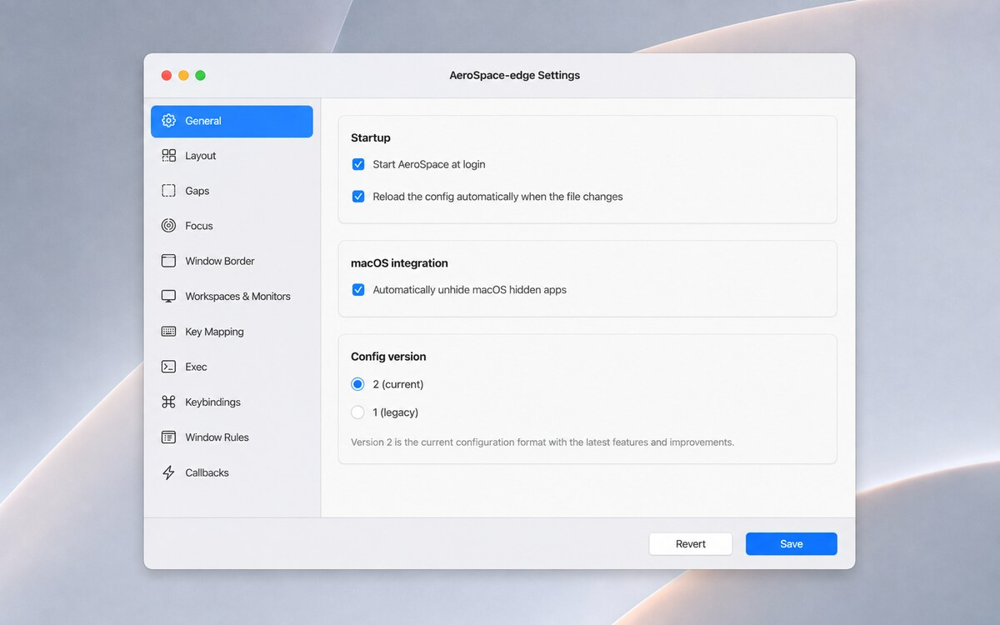

*Figure 1. General config scalars and the explicit config-format choice.*

1. **Startup** controls login registration and file watching.
2. **macOS integration** controls unhiding before focus.
3. **Config version** distinguishes legacy derived workspaces from the explicit v2 list.

| UI label | TOML key | Type / allowed values | Parser fallback | Effect and version | Save/reload behavior | Help interpretation | Preservation |
|---|---|---|---|---|---|---|---|
| Start AeroSpace at login | `start-at-login` | Boolean | `false` | Registers or removes the AeroSpace-edge login item. | Applied after validated Save/reload. | Does not quit a running instance when disabled. | Scalar-only rewrite. |
| Reload the config automatically when the file changes | `auto-reload-config` | Boolean | `false` | Watches the active file after the first manual reload. | Save reloads once; later file edits reload automatically. | Leave off when another tool owns reload timing. | Scalar-only rewrite. |
| Automatically unhide macOS hidden apps | `automatically-unhide-macos-hidden-apps` | Boolean | `false` | Unhides an application before focusing one of its windows. | Runtime behavior changes after reload. | Counteracts macOS's application-wide Hide action. | Scalar-only rewrite. |
| Config version | `config-version` | Integer `1` or `2` | `1` when omitted; bundled default writes `2` | v1 derives persistent workspaces; v2 requires the explicit list. v1→v2 is transactional; v2→v1 is not an inverse migration. | A v1→v2 Save asks for confirmation and creates a backup. | This is a file format, not the app version. | Migration owns only this key and `persistent-workspaces`; see [migration](#migrate-version-1-to-version-2). |

## Layout

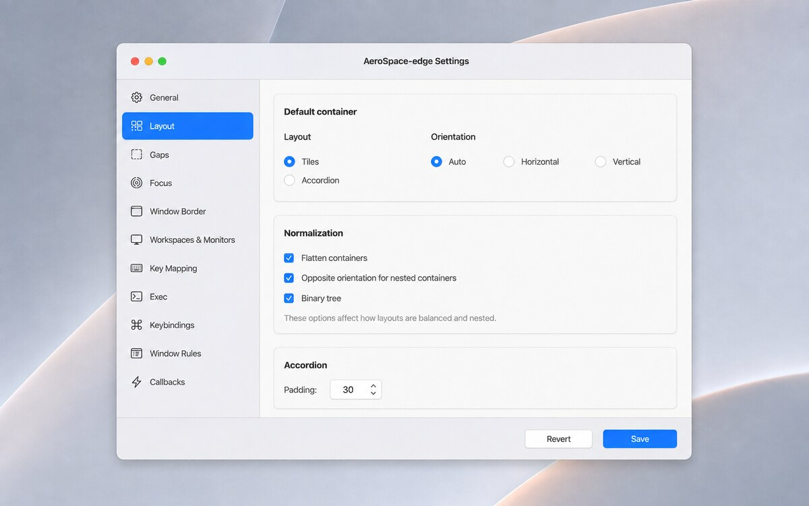

*Figure 2. Defaults for new workspaces and tree-normalization policy.*

1. **Default container** chooses layout and initial split direction.
2. **Normalization** keeps or relaxes automatic tree cleanup.
3. **Accordion** sets the visible stacked-window strip.

| UI label | TOML key | Type / allowed values | Default | Exact effect | Runtime/version | Help interpretation | Preservation |
|---|---|---|---|---|---|---|---|
| Layout | `default-root-container-layout` | `tiles` or `accordion` | `tiles` | Chooses the root layout for new workspaces. | Existing workspaces keep their current layout; all versions. See [Layouts](guide.md#layouts). | Tiles divide the area; Accordion stacks headers around one main window. | Scalar-only rewrite. |
| Orientation | `default-root-container-orientation` | `auto`, `horizontal`, `vertical` | `auto` | Chooses a workspace's first split direction. | Used when roots are created; all versions. | Auto is horizontal on wide displays and vertical on tall displays. | Scalar-only rewrite. |
| Flatten containers | `enable-normalization-flatten-containers` | Boolean | `true` | Merges redundant same-orientation nesting. | Reapplied on reload/refresh; all versions. See [Normalization](guide.md#normalization). | Off preserves manually created nesting levels. | Scalar-only rewrite. |
| Opposite orientation for nested containers | `enable-normalization-opposite-orientation-for-nested-containers` | Boolean | `true` | Alternates horizontal and vertical nesting. | Reapplied on reload; binary-tree mode takes precedence. | Prevents redundant same-direction nesting. | Scalar-only rewrite. |
| Binary tree | `enable-normalization-binary-tree` | Boolean | `false` | Reshapes containers to at most two children and chooses orientation from their rectangles. | Reapplied on reload; AeroSpace-edge-specific. | Overrides opposite-orientation normalization. | Scalar-only rewrite. |
| Padding | `accordion-padding` | Integer; UI `0…200`, step `5` | `30` | Controls how much of neighbouring accordion windows remains visible. | Relayouts after reload; all versions. | `0` removes the tab-like strips. | Scalar-only rewrite. |

## Gaps

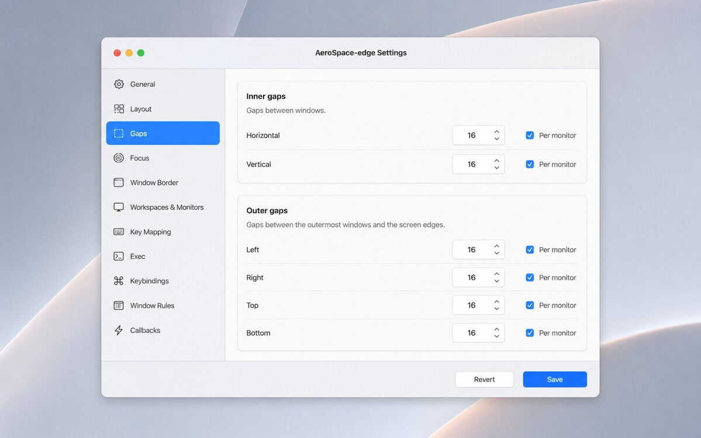

*Figure 3. Inner and outer gap values, each optionally specialized per monitor.*

1. **Inner gaps** separate adjacent tiled windows horizontally and vertically.
2. **Outer gaps** separate tiles from each display edge.
3. **Per monitor** expands a value into ordered monitor rules plus a default fallback.

Each key accepts an integer or an ordered per-monitor array such as
`[{ monitor.main = 20 }, { monitor."Studio Display" = 12 }, 8]`. Descriptions are `main`,
`secondary`, a 1-based monitor number, or a monitor-name regex. The UI range is `0…400`
in steps of `2`; the final plain integer is the fallback. Rules are tested in order.

| UI label | TOML key | Default | Exact effect / visual | Runtime/version | Preservation |
|---|---|---|---|---|---|
| Horizontal | `gaps.inner.horizontal` | `0` | Space between tiled columns. | Relayouts after Save/reload; all versions. | Editing any gap regenerates the whole `gaps` family. |
| Vertical | `gaps.inner.vertical` | `0` | Space between tiled rows. | Relayouts after Save/reload; all versions. | Same whole-family caveat. |
| Left | `gaps.outer.left` | `0` | Left screen-edge margin. | Relayouts after Save/reload; all versions. | Same whole-family caveat. |
| Right | `gaps.outer.right` | `0` | Right screen-edge margin. | Relayouts after Save/reload; all versions. | Same whole-family caveat. |
| Top | `gaps.outer.top` | `0` | Top edge margin; useful around a menu bar. | Relayouts after Save/reload; all versions. | Same whole-family caveat. |
| Bottom | `gaps.outer.bottom` | `0` | Bottom edge margin; useful around a Dock. | Relayouts after Save/reload; all versions. | Same whole-family caveat. |

## Focus

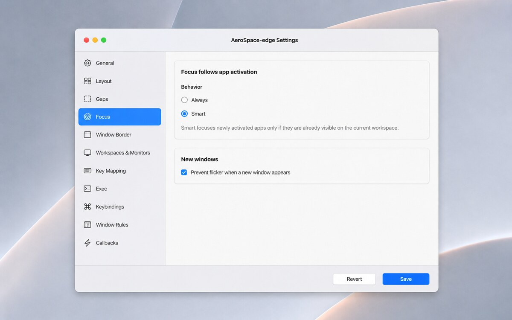

*Figure 4. Focus behavior specific to application activation and new-window placement.*

1. **Behavior** chooses unconditional or user-initiated app following.
2. **Prevent flicker** delays showing a new window until its first layout is ready.

| UI label | TOML key | Type / values | Default | Exact effect | Runtime/version | Help interpretation | Preservation |
|---|---|---|---|---|---|---|---|
| Behavior | `focus-follows-app-activation` | `always` or `smart` | `always` | `always` follows any activated app; `smart` follows cross-workspace activation only when it resembles a recent user click. | Runtime after reload; AeroSpace-edge-specific. | Smart avoids background focus stealing; keyboard-only Cmd-Tab is not treated as a click. | Scalar-only rewrite. |
| Prevent flicker when a new window appears | `new-window-prevent-flicker` | Boolean | `false` | Hides a detected window offscreen until its initial tiling layout is ready. | Runtime after reload; AeroSpace-edge-specific and app-dependent. | Reduces the native-position flash, but unusual windows can appear slightly later. | Scalar-only rewrite. |

## Window Border

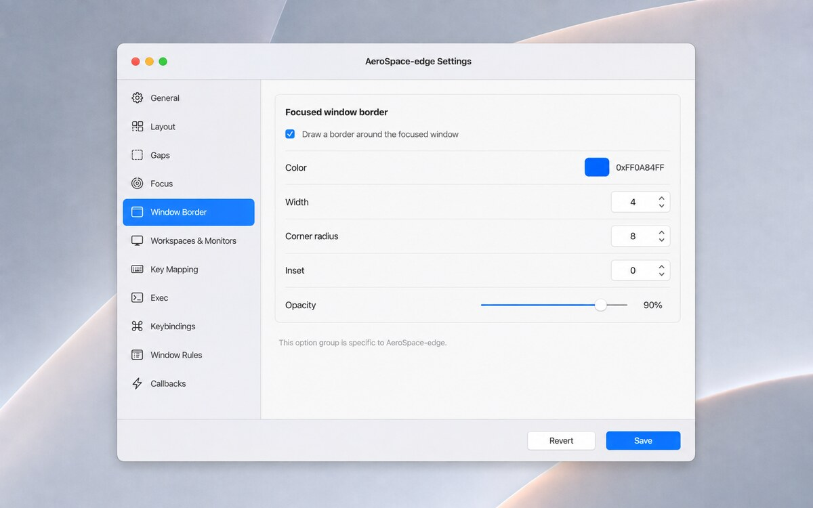

*Figure 5. AeroSpace-edge's focused-window border overlay.*

1. The master toggle enables the overlay.
2. Color and opacity determine its final appearance.
3. Width, corner radius, and inset fit it to application windows.

| UI label | TOML key | Type / UI range | Default | Exact effect | Runtime/version | Help interpretation | Preservation |
|---|---|---|---|---|---|---|---|
| Draw a border around the focused window | `focused-window-border` | Boolean | `false` | Draws an overlay around the focused window. | Runtime after reload; AeroSpace-edge-specific. | Does not modify the app window itself. | Scalar-only rewrite. |
| Color | `focused-window-border-color` | String `0xAARRGGBB` | `0xff12B981` | Sets alpha, red, green, and blue. | Runtime after reload. | Unrepresentable text remains a text field instead of being mangled. | Scalar-only rewrite. |
| Width | `focused-window-border-width` | Integer; UI `0…40` | `4` | Border stroke thickness in points. | Runtime after reload. | Larger values cover more edge pixels. | Scalar-only rewrite. |
| Corner radius | `focused-window-border-radius` | Integer; UI `0…60` | `10` | Global border corner radius in points. | Runtime after reload. | Tune approximately to app windows; `0` is square. | Scalar-only rewrite. |
| Inset | `focused-window-border-inset` | Integer; UI `-40…40` | `0` | Positive values move inward; negative values expand outward. | Runtime after reload. | Avoids content overlap or corner gaps. | Scalar-only rewrite. |
| Opacity | `focused-window-border-opacity` | Integer percent; UI `0…100` | `100` | Multiplies the color's alpha. | Runtime after reload. | `100` is fully opaque. | Scalar-only rewrite. |

## Workspaces & Monitors

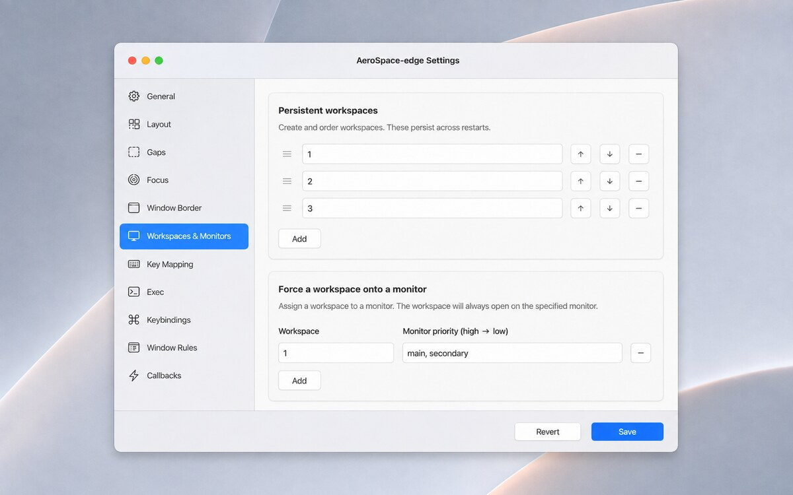

*Figure 6. Persistent workspace order and monitor assignment priorities.*

1. **Persistent workspaces** is an ordered list with add, remove, and move controls.
2. **Workspace and monitor priority** maps each workspace to one or more monitor matches.
3. The first available matching monitor wins.

| UI label | TOML key/table | Type / allowed values | Default | Exact effect | Runtime/version | Help interpretation | Preservation |
|---|---|---|---|---|---|---|---|
| Workspace list | `persistent-workspaces` | Ordered array of non-empty strings | v2: `[]`; v1 derives membership | Keeps named workspaces alive while empty and fixes their menu/navigation order. | v2 only; reload reconciles workspaces. See [`workspace`](commands/workspace.md). | Order is meaningful. | Scalar list rewrite; migration can materialize it. |
| Workspace and monitor priority | `[workspace-to-monitor-force-assignment]` | Workspace key → monitor description or priority array; descriptions are `main`, `secondary`, 1-based integer, or name regex | Empty table | Forces the workspace onto the first available matching monitor. | Applied after reload and as monitor availability changes; all versions. See [Assign workspaces](guide.md#assign-workspaces-to-monitors). | The monitor diagram shows a workspace moving between displays. | Editing any row regenerates the whole table family. |

## Key Mapping

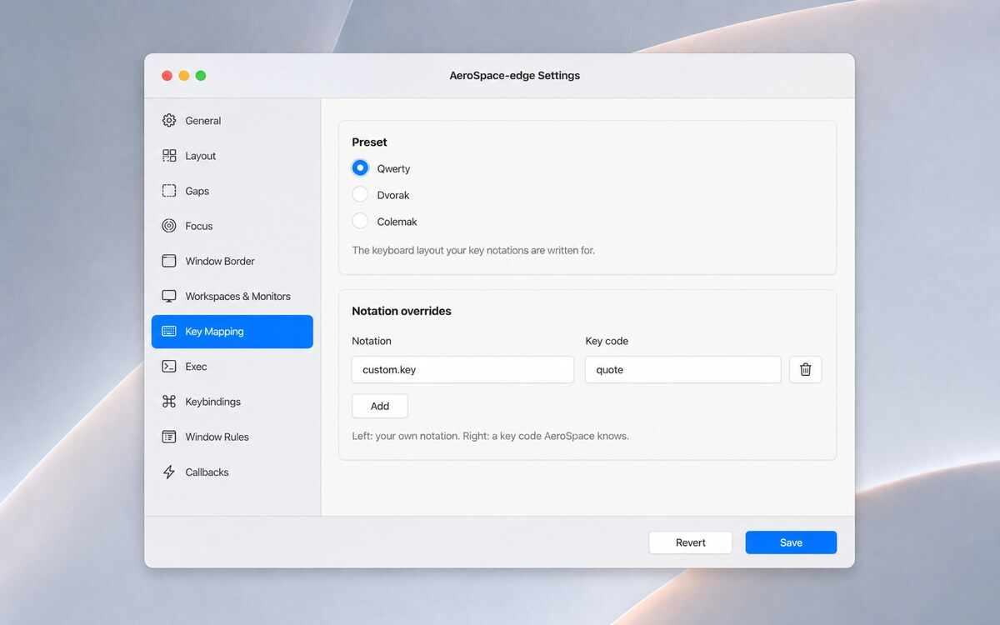

*Figure 7. Keyboard-layout interpretation and notation overrides.*

1. **Preset** selects the layout used to resolve binding notation.
2. **Custom notation mapping** overrides or adds individual notation names.
3. Add/remove rows write the complete key-mapping family on Save.

| UI label | TOML key/table | Type / values | Default | Exact effect | Runtime/version | Help interpretation | Preservation |
|---|---|---|---|---|---|---|---|
| Preset | `key-mapping.preset` | `qwerty`, `dvorak`, or `colemak` | `qwerty` | Maps notation to physical key codes when parsing bindings. | Hotkeys are rebuilt after reload; all versions. See [Keyboard layouts](guide.md#keyboard-layouts-and-key-mapping). | Changes interpretation, not binding text. | Editing either control regenerates the whole `key-mapping` family. |
| Custom notation mapping | `[key-mapping.key-notation-to-key-code]` | String map; notation has no whitespace or `-`, value is a known key-code name | Empty table | Overrides preset resolution or creates a notation used by bindings. | Validated and applied on reload; all versions. | Overrides win over the preset. | Same whole-family caveat. |

## Exec

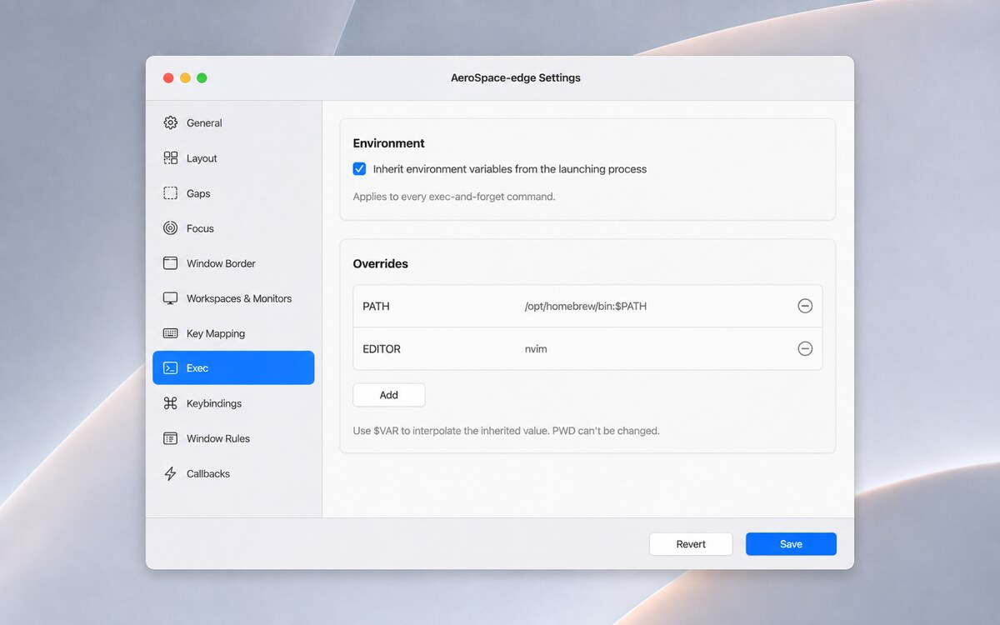

*Figure 8. Environment supplied to future `exec-and-forget` commands.*

1. **Inherit environment variables** controls whether the launch environment is the base.
2. **Environment variable overrides** adds or replaces values.
3. `$VAR` interpolates an inherited value; `PWD` is rejected.

| UI label | TOML key/table | Type / values | Default | Exact effect | Runtime/version | Help interpretation | Preservation |
|---|---|---|---|---|---|---|---|
| Inherit environment variables from the launching process | `exec.inherit-env-vars` | Boolean | `true` | Uses the app launch environment as the command environment base. | Affects subsequent [`exec-and-forget`](commands/exec-and-forget.md) calls after reload; all versions. | Off leaves only explicit and AeroSpace-provided values. | Editing either Exec control regenerates the whole `exec` family. |
| Environment variable overrides | `[exec.env-vars]` | String map with `$VAR` interpolation; `PWD` forbidden | No authored overrides | Adds or replaces variables for every `exec-and-forget`. | Affects subsequent commands after reload; all versions. See [Exec environment](guide.md#exec-env-vars). | A variable can include its inherited value. | Same whole-family caveat. |

## Keybindings

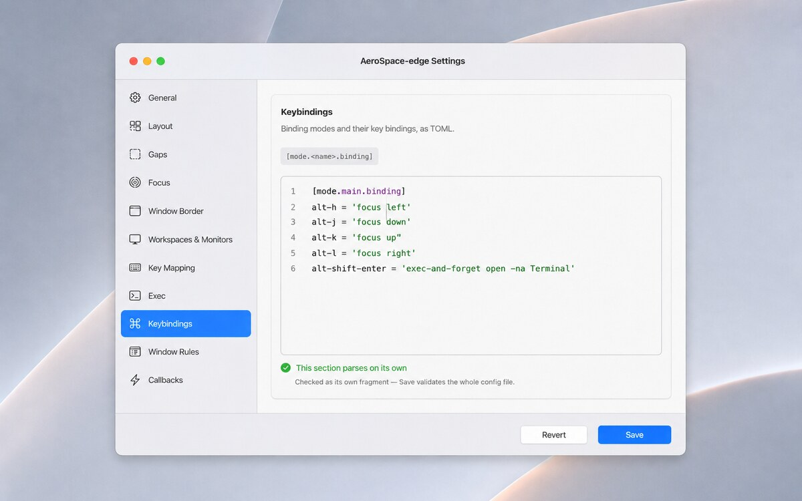

*Figure 9. Raw `[mode.<name>.binding]` tables for AeroSpace's command DSL.*

1. The header identifies the owned table family and accepted binding shape.
2. The editor contains every `[mode]` / `[mode.*]` table from the file.
3. Parse feedback is fragment-only; Save validates the complete config.

Each binding maps a key combination to one command string or an array of command strings.
`[mode.main.binding]` must exist. The pane prepends the current key-mapping preset and
notation overrides only while checking the fragment, so custom notation validates as it
will in the full document. Editing this pane replaces all mode tables; comments inside
that owned family survive only if they remain in the edited text. See [Binding modes](guide.md#binding-modes),
[`mode`](commands/mode.md), and the [command index](aerospace.md).

## Window Rules

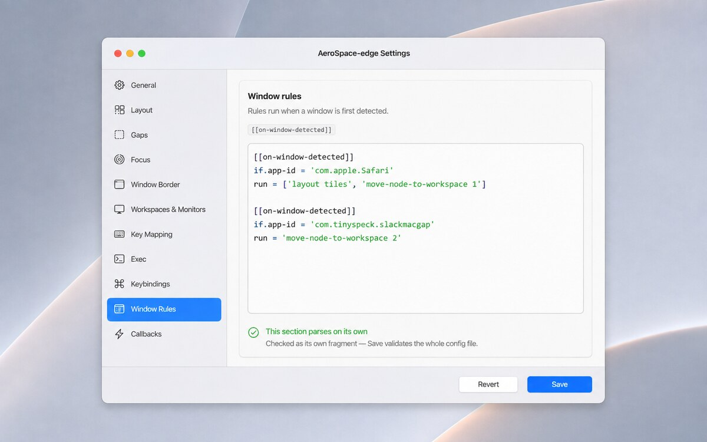

*Figure 10. Raw `[[on-window-detected]]` rules.*

1. The help block lists supported matcher families.
2. Each rule has matcher fields and mandatory `run` command(s).
3. Parse feedback is fragment-only; full Save validation is authoritative.

The pane owns every `[[on-window-detected]]` table. Matchers include `app-id`,
`app-id-regex-substring`, `app-name-regex-substring`,
`window-title-regex-substring`, `workspace`, and `during-aerospace-startup`; `run` is a
command string or array. Editing replaces the complete rule family. See
[on-window-detected callbacks](guide.md#on-window-detected-callback).

## Callbacks

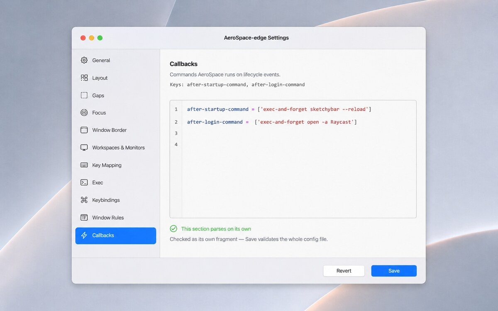

*Figure 11. Raw lifecycle callbacks owned by Settings.*

1. The help block names callback ownership.
2. Values are command strings or arrays using the same command DSL.
3. Parse feedback is fragment-only; Save validates interactions with the full file.

The pane owns `after-startup-command`, `on-focus-changed`, `on-mode-changed`,
`on-focused-monitor-changed`, and `exec-on-workspace-change`; their parser fallback is an
empty command list. The deprecated `after-login-command` is preserved but not edited here.
When this pane changes, those five keys are removed from their old positions and inserted
as the edited block, so nearby comments and interleaving are preserved only if included in
the pane. See [Callbacks](guide.md#callbacks).

## Migrate version 1 to version 2

Version 1 infers persistent workspaces. Version 2 changes the fallback to an empty list and
therefore requires the old behavior to be authored explicitly. Merely opening Settings,
saving unrelated v1 edits, or omitting `config-version` does not migrate or create a
backup. Migration begins only when a loaded effective-v1 draft is changed to version 2
and Save is confirmed.

Before Save, General warns that the operation will materialize
`persistent-workspaces`, create a byte-identical backup, and change no file until
confirmation. If an external edit is also detected, that confirmation appears first.

The list is deterministic:

1. Scan every binding mode in TOML source order.
2. Add targets of `workspace <name>` and `move-node-to-workspace <name>` in encounter
   order; first occurrence wins.
3. Append assignment-only keys from `workspace-to-monitor-force-assignment` in source
   order.

For example:

```toml
# version 1 (config-version omitted)
[mode.main.binding]
alt-2 = 'workspace 2'
alt-1 = 'workspace 1'
alt-a = 'move-node-to-workspace A'

[workspace-to-monitor-force-assignment]
Z = 'secondary'
```

becomes semantically equivalent version 2 with:

```toml
config-version = 2
persistent-workspaces = ['2', '1', 'A', 'Z']
```

No other key or table is migration-owned. Existing source regions outside those two keys
remain byte-identical, and any other form edits made before the same Save are applied only
after the migrated baseline is established.

The backup is beside the resolved target and is named:

```text
<filename>.backup-v1-YYYYMMDD-HHmmss
```

Collisions receive `-2`, `-3`, and so on; an existing backup is never overwritten. After
success, Settings displays selectable text exactly like:

```text
Migrated to config version 2. Backup: /absolute/path/to/config.toml.backup-v1-20260829-203000
```

**Reveal Backup** opens that exact file in Finder. To restore a regular file, copy the
backup over the active target and reload:

```sh
cp '/absolute/path/config.toml.backup-v1-20260829-203000' '/absolute/path/config.toml'
aerospace-edge reload-config
```

For a symlinked config, copy onto the resolved target shown beside the backup—not onto the
symlink path—then reload. This keeps the symlink itself intact.

Failure guarantees are deliberately ordered:

- Candidate validation failure: no backup and no write.
- Backup failure: no write.
- Real-target write failure: the original bytes are restored from the backup; the backup
  remains available.
- Reload failure after a successful write: the migrated file and backup remain, and the
  error includes the backup path for recovery.

## Invalid config, ambiguous paths, and raw recovery

If the file cannot parse, Settings cannot construct structured controls. It displays the
parser error and one raw editor for the entire file. Edit and Save there; complete-file
validation still runs before writing, and the structured form returns after a successful
save/reload.

If several files exist within the selected resolution tier, Settings is read-only. Remove
or rename all but one candidate and reopen Settings. It never writes to an arbitrary
candidate.

The Keybindings, Window Rules, and Callbacks green status means only that the individual
fragment parses (with the Keybindings preamble where needed). Cross-section conflicts and
the complete source are checked only by Save, whose result is authoritative.
