# Focus

**Where:** menu bar → **Settings…** → **Focus**

Both options on this page are AeroSpace-edge-specific — upstream AeroSpace has neither.

## Focus follows app activation

What happens when macOS activates an app that lives on a *different* workspace — a
notification click, an `open` from the shell, a background app raising itself.

- **Always** — follow the activated app to its workspace, every time.
- **Smart** — follow only when the activation looks user-initiated, i.e. it resembles a
  recent click. Background activity no longer yanks you to another workspace.

Keyboard-only ⌘-Tab is not treated as a click, so under **Smart** it does not switch the
visible workspace.

**TOML** `focus-follows-app-activation` · **values** `always` / `smart` ·
**default** `always` · **applies** after reload

## New windows

### Prevent flicker when a new window appears

A newly detected window is briefly drawn wherever the app itself decided to put it, before
AeroSpace-edge tiles it. This option hides the window offscreen until its first layout is
ready, so it only ever appears in its final place.

The trade-off: an unusual window can appear a fraction later than it otherwise would.

**TOML** `new-window-prevent-flicker` · **values** `true` / `false` · **default** `false` ·
**applies** after reload, to windows detected from then on
