# Gaps

**Where:** menu bar → **Settings…** → **Gaps**


Six spacing values: two between windows, four between the tiling area and the screen edges.
Each one can be a single number or a list of per-monitor rules.

!!! warning "Whole-family rewrite"

    Changing *any* gap value regenerates the complete `gaps` table family, including
    `[gaps.inner]` and `[gaps.outer]`. Comments and custom ordering written inside those
    tables do not survive the Save.

## Inner gaps

Space between adjacent tiled windows.



| UI label | TOML key | Default | Effect |
|---|---|---|---|
| Horizontal | `gaps.inner.horizontal` | `0` | Space between tiled columns |
| Vertical | `gaps.inner.vertical` | `0` | Space between tiled rows |

## Outer gaps

Space between the outermost windows and each screen edge, independently per edge — room for
the menu bar, the Dock, or just a visual margin.



| UI label | TOML key | Default | Effect |
|---|---|---|---|
| Left | `gaps.outer.left` | `0` | Left screen-edge margin |
| Right | `gaps.outer.right` | `0` | Right screen-edge margin |
| Top | `gaps.outer.top` | `0` | Top margin, e.g. under the menu bar |
| Bottom | `gaps.outer.bottom` | `0` | Bottom margin, e.g. above the Dock |

The UI range for every gap is `0…400` in steps of `2`.

## Per monitor

Each **Per monitor** checkbox turns that single value into an ordered list of rules plus a
plain fallback:

```toml
[gaps.outer]
top = [{ monitor.main = 34 }, { monitor."Studio Display" = 12 }, 8]
```

Rules are tested **in order**, and the trailing plain integer is the fallback used when none
match. The monitor patterns are the same ones
[workspace-to-monitor assignment](../guide.md#assign-workspaces-to-monitors) accepts.

Ticking **Per monitor** keeps the value you already had as the fallback. Unticking it
collapses the row back to that fallback but remembers the rules, so toggling it off and on
again in the same session brings them back. A **Revert** — or the reload after a successful
Save — clears that memory, so rules you discarded are never resurrected.

All of this is a draft edit: nothing is written until Save.
