# Settings window

AeroSpace-edge edits its own config from a GUI. Open it from the menu-bar icon →
**Settings…**. It is not a separate config store: it reads and writes the same TOML file
AeroSpace-edge already loads at startup, in place.

The window has two kinds of control:

- **Application controls** (the *Menu Bar* and *Application* destinations) act immediately and
  never touch your TOML.
- **Configuration controls** (everything else) build a *draft*. Nothing is written until you
  press **Save**.

Each page in this section mirrors one destination in the window's sidebar, in the same
order, so "where do I change this?" has a one-line answer everywhere.

| Destination | What you change there |
|---|---|
| [General](general.md) | Start at login, automatic reload, hidden-app unhiding, config version |
| [Layout](layout.md) | Default layout and orientation for new workspaces, normalization, accordion padding |
| [Gaps](gaps.md) | Inner and outer spacing, optionally per monitor |
| [Focus](focus.md) | Following app activation, new-window flicker |
| [Window Border](window-border.md) | The focused-window overlay and its appearance |
| [Workspaces & Monitors](workspaces.md) | Persistent workspace list and monitor priority |
| [Key Mapping](key-mapping.md) | Keyboard preset and key-notation overrides |
| [Exec](exec.md) | Environment handed to `exec-and-forget` commands |
| [Keybindings](keybindings.md) | Raw `[mode.*.binding]` TOML |
| [Window Rules](window-rules.md) | Raw `[[on-window-detected]]` TOML |
| [Callbacks](callbacks.md) | Raw lifecycle callback TOML |
| [Menu Bar](menu-bar.md) | How workspaces are drawn in the menu-bar item (no TOML) |
| [Application](application.md) | Config-file actions, crash reports, version info (no TOML) |

!!! note "About the screenshots"

    The pane screenshots were taken before the **Application** destination was added, so the
    sidebar in them stops at *Callbacks*. Everything else matches the current window.

## How a Save works

**Check for Updates…** sits in the window footer, so it is reachable from every destination.
It acts immediately and never touches your TOML.

The raw TOML editors — Keybindings, Window Rules, Callbacks, and the whole-file editor shown
when a config doesn't parse — colour comments, strings, numbers, booleans, table headers and
keys, following VS Code's light and dark palettes. The colouring is derived from the text, not
from a parse, so a half-typed or invalid document still reads as TOML; **Save** remains the
only thing that validates.

Editing any control enables **Save** and **Revert**. Reopening an already-visible window
does not reload it and discard your draft; **Revert** reloads from disk. While a Save or a
reload is running, every control and both buttons are frozen, so an edit can't land in the
gap and be silently thrown away.

Before touching the real file, Settings renders a candidate into a temporary file and
validates the whole document with the same parser used at startup:

- **Validation fails** → nothing is written and the error is shown in the footer.
- **Validation passes** → the resolved target is replaced atomically, its POSIX permissions
  are restored, the active config is reloaded, and the footer reports **Saved and reloaded**.

If the file's modification date changed after Settings loaded it, Save first offers
**Overwrite**, **Discard my changes**, and **Cancel**. Overwrite still goes through normal
validation; Discard reloads the external version.

## What a Save rewrites

Only the regions you actually edited are emitted.

| You changed | What is rewritten |
|---|---|
| A single scalar | Just that key. Untouched scalars, unknown keys, comments, ordering and whitespace stay byte-identical. |
| Anything in `gaps`, `key-mapping`, `exec`, or `workspace-to-monitor-force-assignment` | The complete table family, including sub-tables. Comments and custom ordering inside that family do **not** survive. |
| Keybindings or Window Rules | That pane's complete owned table family. |
| Callbacks | Its five owned keys are removed from their old positions and reinserted as the edited block. |
| Nothing in a pane or table family | It stays byte-identical. |

## Which file Settings edits

Settings edits whichever config AeroSpace-edge already resolved at startup — the same
lookup order, and the same `--config-path` override, described in
[Custom config location](../guide.md#custom-config-location). Three cases are specific to
this window:

**No custom config yet.** Settings shows the bundled default. The first Save creates
`~/.aerospace-edge.toml`, seeded from that default; the footer announces this before
writing. **Application → Open config** likewise copies the bundled default there before
opening it.

**Two candidates in the same resolution tier.** Settings opens read-only and lists them
rather than guessing which one you meant.

When the resolved path is a symlink, Settings reads and writes the *target*. The symlink
stays a symlink, the target's permissions are preserved, and a migration backup is placed
beside the real target.

## Defaults shown here are parser fallbacks

The default listed on each page is what the parser assumes when the key is **absent**,
which can differ from what the bundled default config writes explicitly. The clearest case
is `config-version`: omitting it means version 1, while the bundled default writes
version 2. See [Config version migration](migration.md).

## Find a setting by TOML key

| TOML key | Where in Settings |
|---|---|
| `start-at-login`, `auto-reload-config` | [General → Startup](general.md#startup) |
| `automatically-unhide-macos-hidden-apps` | [General → macOS integration](general.md#macos-integration) |
| `config-version` | [General → Config version](general.md#config-version) |
| `default-root-container-layout`, `default-root-container-orientation` | [Layout → Default container](layout.md#default-container) |
| `enable-normalization-*` | [Layout → Normalization](layout.md#normalization) |
| `accordion-padding` | [Layout → Accordion](layout.md#accordion) |
| `gaps.inner.*`, `gaps.outer.*` | [Gaps](gaps.md) |
| `focus-follows-app-activation` | [Focus → Focus follows app activation](focus.md#focus-follows-app-activation) |
| `new-window-prevent-flicker` | [Focus → New windows](focus.md#new-windows) |
| `focused-window-border*` | [Window Border](window-border.md) |
| `persistent-workspaces` | [Workspaces & Monitors → Persistent workspaces](workspaces.md#persistent-workspaces) |
| `workspace-to-monitor-force-assignment` | [Workspaces & Monitors → Workspace and monitor priority](workspaces.md#workspace-and-monitor-priority) |
| `key-mapping.*` | [Key Mapping](key-mapping.md) |
| `exec.*` | [Exec](exec.md) |
| `mode.*.binding` | [Keybindings](keybindings.md) |
| `on-window-detected` | [Window Rules](window-rules.md) |
| `after-startup-command`, `on-focus-changed`, `on-mode-changed`, `on-focused-monitor-changed`, `exec-on-workspace-change` | [Callbacks](callbacks.md) |

## When Settings can't edit normally

**The config doesn't parse.** Settings can't build structured controls from a file it can't
read, so it shows the parser error and one raw editor over the whole file. Edit and Save
there — whole-file validation still runs before writing — and the structured form comes back
after a successful save and reload.

**Several config files exist in the same tier.** Settings opens read-only and lists the
candidates. Remove or rename all but one, then reopen Settings. It never writes to an
arbitrary candidate.

**A raw pane shows green but Save fails.** The green status on Keybindings, Window Rules and
Callbacks means only that *that fragment* parses on its own. Cross-section conflicts and the
complete source are checked by Save, and Save's result is the authoritative one.
