# Layout

**Where:** menu bar → **Settings…** → **Layout**

What a *new* workspace looks like, how aggressively AeroSpace-edge tidies the window tree,
and how much of a stacked accordion stays visible.

## Default container

### Layout

Chooses the root layout for workspaces created from now on. Existing workspaces keep the
layout they already have until you change them with [`layout`](../commands/layout.md).

*Tiles divide the available area. Accordion stacks the windows and shows one at a time, with
the neighbours reduced to tab-like strips.*

**TOML** `default-root-container-layout` · **values** `tiles` / `accordion` ·
**default** `tiles` · **applies** to workspaces created after reload ·
see [Layouts](../guide.md#layouts)

### Orientation

The direction of a workspace's *first* split.

`auto` picks horizontal on a wide display and vertical on a tall one.

**TOML** `default-root-container-orientation` · **values** `auto` / `horizontal` /
`vertical` · **default** `auto` · **applies** when a workspace root is created

## Normalization

Normalizations keep the window tree tidy. Turning them off gives you full manual control of
the tree — and full responsibility for it. See [Normalization](../guide.md#normalization).

### Flatten containers

A container left with only one child no longer adds any structure, so AeroSpace-edge
replaces it with that child. The root container is the exception — it may keep a single
window child.

Turn it off to preserve every manually created nesting level. Empty containers are removed
either way.

**TOML** `enable-normalization-flatten-containers` · **values** `true` / `false` ·
**default** `true` · **applies** on every reload and refresh

### Opposite orientation for nested containers

A horizontal parent gets vertical children and vice versa, which stops redundant nesting
from appearing in the first place.

**TOML** `enable-normalization-opposite-orientation-for-nested-containers` ·
**values** `true` / `false` · **default** `true` ·
**note** binary-tree normalization takes precedence when both are on

### Binary tree

Reshapes the tree so every container has at most two children, choosing each container's
orientation from the shape of its rectangle. AeroSpace-edge-specific.

**TOML** `enable-normalization-binary-tree` · **values** `true` / `false` ·
**default** `false` · **note** overrides opposite-orientation normalization

## Accordion

### Padding

How much of the neighbouring windows stays visible in an accordion, as a tab-like strip.

`0` removes the strips entirely, so only the focused window is visible.

**TOML** `accordion-padding` · **values** integer, `0…200` in the UI (step 5) ·
**default** `30` · **applies** at the next layout after reload
