# Window Border

**Where:** menu bar → **Settings…** → **Window Border**

An overlay drawn around whichever window has focus. It is painted *over* the window; the
app's own frame is never modified. AeroSpace-edge-specific.

## Focused window border

### Draw a border around the focused window

The master switch. Everything below it is disabled until this is on.

**TOML** `focused-window-border` · **values** `true` / `false` · **default** `false` ·
**applies** after reload

### Color

Stored as `0xAARRGGBB` — alpha, red, green, blue. The colour well writes back exactly that
representation. If the current value is something the picker can't represent, the row stays a
plain text field instead of silently rewriting your value.

**TOML** `focused-window-border-color` · **default** `0xff12B981`

### Width

Stroke thickness in points. Larger values are easier to spot and cover more pixels near the
window edge.

**TOML** `focused-window-border-width` · **values** integer, `0…40` in the UI ·
**default** `4`

### Corner radius

Rounds the border's corners. Match it roughly to the app window's own radius; `0` is square.

**TOML** `focused-window-border-radius` · **values** integer, `0…60` in the UI ·
**default** `10`

### Inset

Moves the border relative to the window frame. Positive values pull it inward (useful when
it covers content), negative values push it outward (useful when the corners leave a gap).

**TOML** `focused-window-border-inset` · **values** integer, `-40…40` in the UI ·
**default** `0`

### Opacity

Multiplies the colour's alpha. `100` is fully opaque; lower values let the window and
desktop show through.

**TOML** `focused-window-border-opacity` · **values** integer percent, `0…100` ·
**default** `100`
