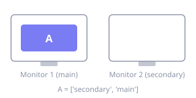

# Workspaces & Monitors

**Where:** menu bar → **Settings…** → **Workspaces & Monitors**


Which workspaces always exist, in what order, and which monitor each one prefers.

## Persistent workspaces

An ordered list of workspace names that always exist, even when empty — so a workspace
doesn't vanish from menus and navigation the moment its last window closes. The order here is
also their stable order everywhere else.

**TOML** `persistent-workspaces` · **values** array of non-empty strings ·
**default** `[]` under config version 2 · **requires** config version 2 ·
see [`workspace`](../commands/workspace.md)

Under [config version 1](migration.md) this list is *derived* from your bindings and monitor
assignments rather than authored, which is exactly what the version 1 → 2 migration
materializes for you.

Add, remove and reorder rows in place; the whole list is rewritten on Save.

## Workspace and monitor priority

Forces a workspace onto a preferred monitor. Each row maps a workspace to one monitor
description, or to several in priority order — AeroSpace-edge uses the first one that is
currently available, and moves the workspace as monitors come and go.



A monitor description is `main`, `secondary`, a 1-based monitor number, or a regex matched
against the monitor name:

```toml
[workspace-to-monitor-force-assignment]
1 = 'main'
A = ['secondary', 'main']
B = '^Studio Display$'
```

**TOML** `[workspace-to-monitor-force-assignment]` · **default** empty table ·
**applies** after reload and whenever monitor availability changes ·
see [Assign workspaces to monitors](../guide.md#assign-workspaces-to-monitors)

!!! warning "Whole-family rewrite"

    Editing any row regenerates the complete `workspace-to-monitor-force-assignment` table.
    Comments and custom ordering inside it do not survive the Save.
